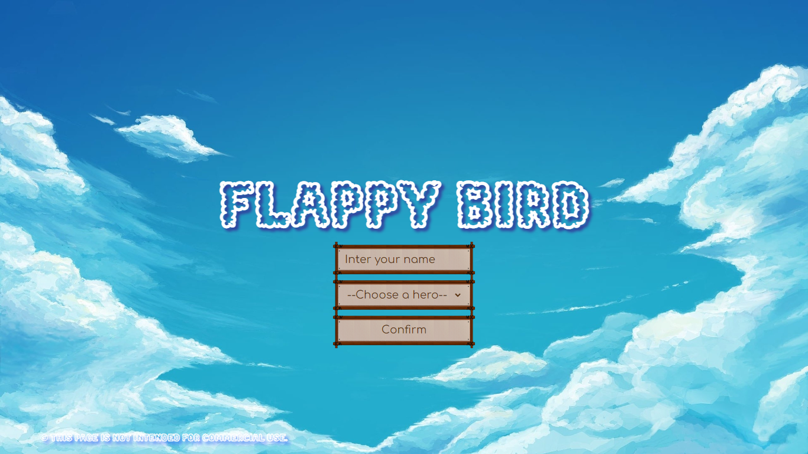

# Проект: игра Flappy Bird.

### [ Ссылка на проект ](https://rassellek.github.io/flappy-bird/)

Flappy Bird — игра, в которой игрок с помощью касаний экрана (или нажатия любой клавиши на PC) должен контролировать полёт птицы между рядами препятствий, не задевая их.

Чтобы начать игру введите своё имя, выберите персонажа и подтвердите свой выбор.

 

### Данный проект создавался на стеке:

 

### Используемые программы:

